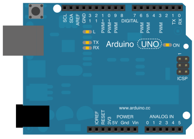

# GPIO

Greenwich devices have up to five user-programmable [GPIO](http://en.wikipedia.org/wiki/General-purpose_input/output) pins, depending on the model, but at least three are available on the entry-level "Java" version:

This is the 14pin Molex connector seen from the back (i.e. plugged into `S1` on the Greenwich)


* `GPIO1`, Pin S1-5, light-blue cable, topic name: `/gpio/1`
* `GPIO3`, Pin S1-12, grey cable, topic name: `/gpio/3`
* `GPIO7`, Pin S1-11, green _ignition_ cable (normally connected to fuse), topic name: `/gpio/7`

Each input has an allowed voltage range of +- VIN (9-32V) with LOW being recognized at `<0.5V` and HIGH at `>3.0V`.

The OwnTracks-Edition of the software surfaces the state (HIGH/LOW) of these pins into MQTT publishes by publishing a payload of `0` or `1`, respectively, depending on the pin's state. One publish occurs per pin as soon as its state changes. Note, that the internal state is inverted compared to the external level; this is supposed to be typical for embedded devices. In other words, the published payload is `0` for HIGH and `1` for LOW.

The topic used for publishing is the general topic of the device with `/gpio/<pin>` appended to it:

```
owntracks/gw/GWCAR-jp/gpio/1 1
owntracks/gw/GWCAR-jp/gpio/3 1
owntracks/gw/GWCAR-jp/gpio/7 0
```



In order to toggle these pins with, say, an Arduino, you can use a this small sketch on a basic Arduino board. The following is a variation of the _blink_ sketch which flips PIN 10 connected to GPIO1 on the Greenwich every 5 seconds, and blinks LED13 on the Arduino accordingly.

```
#define LED        13
#define GREENWICH  10

void setup() {
    pinMode(LED, OUTPUT);
    pinMode(GREENWICH, OUTPUT);
}

void loop() {
    digitalWrite(LED, HIGH);
    digitalWrite(GREENWICH, HIGH);
    delay(5000);
    digitalWrite(LED, LOW);
    digitalWrite(GREENWICH, LOW);
    delay(5000);
}
```
