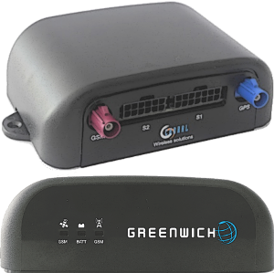

OrionMqtt - OwnTracks Edition
=============================

This project started off as a fork of [Choral's OrionMQTT demo app](https://github.com/Choralthings/OrionMqtt). It is a Java MIDlet application which includes the [Paho] library to send [MQTT] position messages in [OwnTracks] format with Choral Greenwich hardware.



The [Choral Greenwich](http://www.choral.it/greenwich) is a Java based GPS- and GPRS-enabled sensing box for vehicles which, together with this application, enables it to routinely report a vehicle's position using the [OwnTracks JSON format](https://github.com/owntracks/owntracks/wiki/JSON) over [MQTT]. An example payload may look like this:

```json
{
    "_type": "location",
    "alt": "160.0",
    "batt": "E4.4V",
    "cog": "0.0",
    "dist": "18903",
    "lat": "xx.xxxxxx",
    "lon": "y.yyyyyy",
    "vel": "0.12038",
    "t": "t",
    "tst": "1406803894"
}
```

Features
--------

* Message payloads compatible with [OwnTracks' JSON](https://github.com/owntracks/owntracks/wiki/JSON) which means you can use the OwnTracks apps to display location data.
* Location updates on a per/time and per/moved distance basis. For example, publish location after vehicle has moved 200 meters or at most 120 seconds, whichever comes first.
* MQTT authentication
* TLS (work in progress)
* Subscription to a configurable topic branch for remote-control / information retrieval.
* Watchdog: device resets itself if GPS or GPRS unavailable or in case of the device hanging itself up.
* Configurable via SMS.
* Over the Air upgrades (OTA)
* MQTT Last Will and Testament (LWT) messages for monitoring

Requirements
------------

The app requires a Greenwich device as well as an [MQTT] broker such as [Mosquitto](http://mosquitto.org) or [HiveMQ](http://www.hivemq.com). Installing the app onto an existing Greenwich requires a serial connection.

Setup
-----

The application is [highly configurable](README_settings.md). Note, that if you have been using a Greenwich, the format of the commands, as well as most of the configurable settings have changed.

Resources
---------

* http://mosquitto.org/
* http://www.choral.it/greenwich
* http://owntracks.org

  [MQTT]: http://mqtt.org
  [Paho]: http://www.eclipse.org/paho/
  [OwnTracks]: http://owntracks.org
