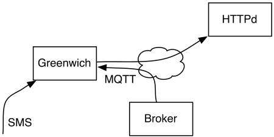

# OTAP {#otap}

Over the Air Provisioning is supported by the OwnTracks Edition, and it can be
triggered either by an MQTT publish, via SMS, or via the console with an `upgrade`
command or, automatically, by having the device periodically query an HTTP(S) URI which
will tell it whether or not to upgrade.




While the command to upgrade can be initiated via these mechanisms, the
upgrade itself is obtained via HTTP from a Web server your devices can access via
the Internet connection provided by the on-board modem. Note that upgrades, while
they're not terribly large (somewhere in the order of 300KB), will incurr additional
charges in your data plan; you should keep this in mind.

The following prerequisites must be met for being able to perform an Over-The-Air upgrade.

Configure the following settings:

```
set otapURI=http://example.com/files/@/OwnTracks.jad
set notifyURI=http://example.com/otap.php?id=@
set otapUser=username
set otapPassword=password
```

`otapURI` sets the base URI for the OTA upgrade. Any number of `@` characters
will be replaced by the device's `clientID`. (If the clientID contains an `@` character,
this conversion is not performed.) So, for a clientID of `dev1`, the
URI above will be expanded to

```
http://example.com/files/dev1/OwnTracks.jad
```

`notifyURI`, `otapUser`, and `otapPassword` are optional and default to empty strings.

Internally, the following AT command is sent to the device to configure OTAP:

```
AT^SJOTAP=,<otapURI>,a:/app,<otapUser>,<otapPassword>,gprs,<apn>,,,8.8.8.8,<notifyURI>
```

The actual upgrade is launched with an `upgrade` command which may also be submitted to the device over MQTT.

Upon receiving the `upgrade`, the device issues `AT^SJOTAP` to perform the actual HTTP GET request for the _jad_ file. This text file contains the URI to the _jar_ file:

```
...
MIDlet-Jar-URL: http://example.com/files/OwnTracks.jar
```

Only if the device can access the URL for the _jar_ will it actually perform a software upgrade. Of course this _jad_ could be generated on-the-fly with a pointer to the location of the _jar_.

As soon as the Greenwich has performed the upgrade, it will send an HTTP POST
to the specified _NotifyURL_. If the upgrade is interrupted for any reason or
the downloaded data is corrupt, the upgrade is revoked, i.e. the device will
reboot with the previously running software. The POST contains something like:

```
900 Success
```

See also: [OTAP on JavaCint](http://www.javacint.com/OTAP)

### `versionURI`

If the Greenwich is configured with a `versionURI`, it will periodically (every
`versionInterval` seconds -- default: 3 hours) perform a HTTP POST to that URI
in order to be informed on whether the device should or should not attempt an OTAP
upgrade as described above.

```
set versionURI=http://example.com/versioncheck
```

The Midlet version currently running on the device is POSTed to the URL (e.g.
`0.1.2`), as though the following had been issued on the command-line:

```
curl -X POST --user-agent "GW/12345678901234" -d 0.1.2 http://example.com/versioncheck
1
```

The resource should return a message with status code 200 and `text/plain` containing
either a `1` or a `0` indicating whether an upgrade should be performed or not, respectively.

Removing the setting will disable version checks:

```
set versionURI=
```

The HTTP User-Agent header is set as illustrated above, by the string `GW/` followed
by the device's IMEI number.

### Notes

* We haven't been able to convice the module to perform OTA upgrades if the `otapURI` doesn't end in the string `".jad"`, irrespective of filename, content-type or content-disposition.
* `otapURI` is invoked with an HTTP GET method, whereas `notifyURI` is POSTed to.
* The scheme must be `http`; HTTP over TLS (`https`) is not supported by the modem. This means that any credentials you use will be passed in clear-text.

\newpage
