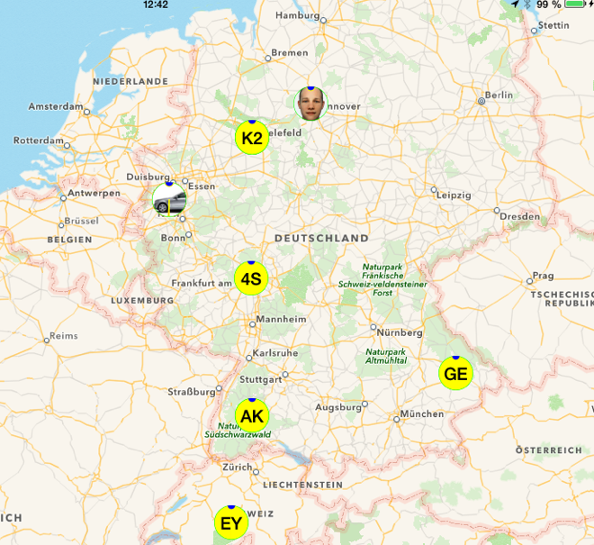

# OwnTracks Apps

Greenwich OwnTracks integrates with the OwnTracks iOS and Android apps because the
MQTT payloads it publishes are compatible with the JSON payloads understood by the apps.
This in turn means, that you can use one of the apps to view the location of any number
of Greenwich devices which use OwnTracks edition software.

\newpage
