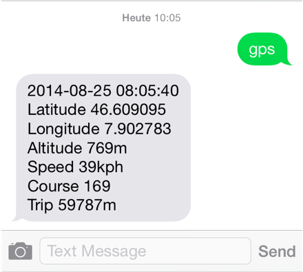

# OwnTracks Apps {#applications}

Greenwich OwnTracks integrates with the OwnTracks iOS and Android apps because the
MQTT payloads it publishes are compatible with the JSON payloads understood by the apps.
This in turn means, that you can use one of the apps to view the location of any number
of Greenwich devices which use OwnTracks edition software.


_Live-Table_ is a Websockets-based Web application which updates in real-time
as soon as an MQTT publish from one of the devices is received at the broker.
Aside from showing device status, it also displays the device's location so
you can see where your vehicles are at at a glance.


We also provide a Web-based map which,
like the apps, updates in real-time. This is made possible by utilizing
Websockets which "talk" to a Websocket-enabled MQTT broker in effect subscribing
to the MQTT topics your devices publish to, extracting the relevant data from
the JSON payloads and using JavaScript to update your vehicles' locations on
a map provided by the Open Street Map project.


\newpage


Our use of MQTT means adding new subscribers which act on data as it arrives at
the MQTT broker is easy. As an example, we want to be alerted when our vehicles
enter a particular area (geo-fence), say, a customer site or one of our warehouses.


A small utility called [mqttwarn](http://github.com/jpmens/mqttwarn) can route
MQTT payloads to a large number of services. The following example shows how an
alert of a van entering a particular area would look like using the
Pushover.net service:


\newpage

If you don't have access to one of the OwnTracks apps, you can query a particular
vehicle's location by sending it an SMS; the vehicle responds with information
on its location via SMS.



\newpage

Data received by the Greenwich devices is stored in a database from which you
can, at any time, query historical data.

OwnTracks' _m2s_ subscribes directly to your MQTT broker and stores all
data it receives in a back-end database (e.g. MySQL or PostgreSQL) from
which you can, at any time, reconstruct where your vehicles have been.

```
mysql> SELECT id, tst, lat, lon FROM location WHERE device = 'van17';
+--------+---------------------+-----------+----------+
| id     | tst                 | lat       | lon      |
+--------+---------------------+-----------+----------+
| 186477 | 2014-08-25 08:06:10 | 46.607067 | 7.90527  |
| 186478 | 2014-08-25 08:07:11 | 46.602936 | 7.906514 |
| 186480 | 2014-08-25 08:08:12 | 46.59976  | 7.907099 |
```

```
SELECT json FROM location WHERE id = 186480;
{"username": "acme", "_type": "location", "dist": "355", "topic": "owntracks/acme/van17",
  "device": "van17", "lat": "46.59976", "alt": "794.9", "lon": "7.907099", "t": "t",
  "vel": "17.338424", "cog": "144.18", "tst": "1408954092"}
```


_m2s_ stores historical data, and you can at any time query
that data and process it. In addition to individual columns that are 
populated, you also have access to the raw JSON that was published by your
devices. Important to remember: it is _your_ data and you own it; the
data is on your premises!


Using _gpxexporter_, which is part of _m2s_, create GPX tracks which can be
viewed in standard GPX viewers such as with
[gpsvisualizer.com](http://www.gpsvisualizer.com) or
with Google Earth.


\newpage
