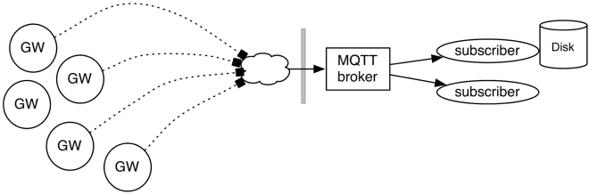

# MQTT

MQTT is an open _publish/subscribe_ protocol for M2M communication, in which
telemetry data is sent as messages with a very low overhead. MQTT is ideal for
"difficult" networks (such as mobile networks), which is why we chose this
protocol for OwnTracks. The MQTT protocol has been standardized since 2013.

The MQTT protocol provides one-to-may message distribution over TCP/IP with a
small transport overhead, and a method to notify parties of abnormal
disconnection of a client. This method is generally known as Last Will and
Testament (LWT) which we use to inform you of a Greenwich' online/offline status.
With MQTT, clients subscribe to be notified of incoming
messages pertaining to specific topics, and other clients publish on those
topics.  MQTT messages are "addressed" with a topic; a little bit like the
name of a channel or a subject. This topic is hierarchical, and allows MQTT
clients to subscribe to certain messages. For example, a Greenwhich in a
particular vehicle may publish location data to a topic `owntracks/acme/van19`,
and you could have a client program receive all messages from all Acme vans by
having it subscribe to `owntracks/acme/+`. (Read more about MQTT at
[mqtt.org](http://mqtt.org).)

An MQTT broker (think of this as the "server-part" of MQTT) is a program to which
clients connect. It verifies that clients are in fact authorized to use the
broker, and it accepts messages which it forward to subscribers. Publishers
publish messages containing a payload, and subscribers receive those messages.
In our particular use-case, Greenwich devices are publishers (although they are
also subscribers; they can receive commands over MQTT), and clients on your
network are subscribers. The [OwnTracks] project has a number of ready-to-use
subscribers which you can use to store Greenwich device data in a database,
alert user's mobile phones of a device entering or leaving a particular region,
display Greenwich device locations on a map or in a so-called _Live Table_, and
of course the OwnTracks iOS and Android apps.

\newpage

# Infrastructure requirements

The infrastructure requirements for running a modest number of Greenwich devices
are minimal. A computer as small as a Rasperry Pi or a Beagle Bone Black is
capable of handling the workload for several dozen Greenwich devices. You can of
course host the required infrastructure within your existing data center.

The requirements for operating one or more Greenwich devices are:

* Greenwich hardware and software (OwnTracks Edition)
* SIM card with data plan. If your vehicles intend to cross international borders,
  you must consider roaming charges or obtain a data plan which includes
  international roaming.
* A "server" (even though that can be ver small) with sufficient storage
* An Internet connection
* Maintenance

\newpage
