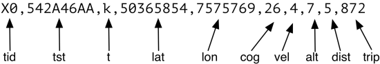

# MQTT payloads {#json}

Greenwich publishes messages containing _payloads_ to particular topics. The topic branch
is user-configurable by setting the `publish` and `clientID` settings. Assuming the former
is set to `owntracks/acme` and the latter to `van17`, the _base topic_ becomes `owntracks/acme/van17`, and that is where location messages (in JSON) are published to. (All publishes are typically
retained, unless you configure `retain=0`.)

Location messages are published in either of two configurable formats:

1. JSON, if `set payload=json` (default) has been configured
2. CSV, if `set payload=csv` has been configured.

### JSON

A JSON message as published by Greenwich could look like this^[JSON elements
marked with an asterisk `(*)` may or may not be present, depending on the
configured `fields`.] (the in-line comments are not valid JSON; we've added
them here as explanation):

```json
{
  "_type": "location",         // type
  "t": "t",                    // trigger type (see table)
  "tst": "1408810440",         // UNIX epoch timestamp
  "tid": "V7",                 // tracker-ID (configurable)
  "lat": "48.858334",          // latitude
  "lon": "2.295134",           // longitude
  "alt": 732,                  // altitude (*)
  "vel": 46,                   // velocity (speed) (*)
  "batt": "12.4",              // external battery level (*)
  "cog": 283,                  // course over ground (*)
  "dist": 569,                 // distance in meters since last publish (*)
  "trip": 8441                 // trip distance in meters since last reboot (*)
                               //  so trip(n+1) = trip(n) + dist(n+1)
}
```

In particular, these elements need explanation


* `trip` is counted incrementally based on the GPS messages reported per/second, whereas
* `dist` is the distance travelled in meters since last publish.

### CSV

Messages published as CSV (Comma Separated Values) are shorter and thus easier on the
volume of data incurred by Greenwich devices. If you are on a tight data budget, CSV
is well suited.

In interest of saving as much as possible data, the CSV messages published by the
device are as follows.



The field names in the diagram correspond to the JSON fields described above. However,
the values can be slightly different.

* `tst` is the hexadecimal (base 16) representation of the UNIX epoch timestamp.
* `lat` and `lon` are integer representations of the latitude and longitude respectively.
  To determine the exact decimal positions, divide both of these values by 1 million.
* `cog` must be multiplied by 10 to arrive at the original approximate course
* `alt` is the original altitude divided by 10.
* `trip` is not in meters (as in JSON) but in Km. Multiply this value by 1000 to obtain
  the value published in JSON.


### Triggers

In the messages above, we mention the word _trigger_. This describes why a particular
location message was published. The following is a list of triggers:

--------- ---------------------------------------------------------
 Trigger  Reason
--------- ---------------------------------------------------------
    f     First publish after reboot.

    c     Device started by alarm (c)lock (`AT^CALA`). Alive signal without
          ignition. Sent instead of `f`.  This message is published
          periodically (even without external power) after `sleep` seconds.

    a     The Movement Sensor or _accelerometer_ is activated when the software shuts down,
          and is monitored even without external power supply (ignition off).
          Its sensitivity is controlled by the `motion` parameters. It wakes up
          the device when moved. Default for `motion` is 4, which is *very*
          sensitive. I set it to 63 of 255. When I shake it, it wakes up. This
          triggers an `a` (alarm) publish which is published to `../alarm`.

    k     When transitioning from _move_ to _stationary_ mode an additional
          publish is sent marked with trigger `k` (park).

    L     Last recorded position upon graceful shutdown .

    l     GPS signal lost (NMEA `A` transitions to `V`). Even though GPS signal
          has gone (e.g. driven into tunnel) we may still have a GPRS signal, so we
          can publish the `l`ast known position.  It is likely that a `t` will
          follow suit.

    m     For manually requested locations (e.g. by publishing to `/cmd`).

    t     (time) for location published because device is moving.

    T     (Time) Vehicle is immobile and `maxInterval` has elapsed.

    v     Move. One `v` trigger is sent on transition from park or `t` to move.
--------- ---------------------------------------------------------

Table: Triggers emitted in location publishes


In addition to location messages as shown above, the Greenwich will also publish additional
messages. Recall that the _base topic_ is constructed from the `publish` setting with
`clientID` appended to it, for example `owntracks/acme/van17`.

+------------------+-------------------------------------------------------------------------------+
|Topic             |Content                                                                        |
+==================+===============================================================================+
|`../status`       |Connection status of the Greenwich
+------------------+-------------------------------------------------------------------------------+
|                  |* `1` Greenwich sets this status immediately after connect
|                  |* `0` MQTT broker sets this status when it looses the connection to the Greenwich client using the _LWT_ mechanism
|                  |* `-1` Greenwich disconnects intentionally (on user request, ignition-off, etc.)
+------------------+-------------------------------------------------------------------------------+
|`../start`        |  _IMEI_ _midlet-version_ _date/time_
|                  |  For example: 
|                  |  `123456789012345 0.7.38 2014-09-01 08:37:04`
+------------------+-------------------------------------------------------------------------------+
|`../voltage/batt` |   Built-in battery voltage is published when voltage
|                                changes "significantly", as configured with `dBattVoltage`.
|                                (`4.4`)
+------------------+-------------------------------------------------------------------------------+
|`../voltage/ext`  |   External power supply voltage is published when voltage
|                                changes "significantly", as configured with `dExtVoltage`.
|                                (`12.2`)
+------------------+-------------------------------------------------------------------------------+
|`../gpio/`_n_     |   Status of the three [GPIO](#gpio) pins (`1`, `3`, `7`) is published as `0` or `1`.
+------------------+-------------------------------------------------------------------------------+
|`../cmd/out`      |   Output of commands sent to the device (e.g. `login`, `set`):
+------------------+-------------------------------------------------------------------------------+
|`../alarm`        |   A location payload with a trigger type `a` is published (non-retained)
|                                when a switched-off device is moved.
|                                `{"_type": "location",  "t": "a", ...}`
+------------------+-------------------------------------------------------------------------------+

: Topics published to


\newpage
