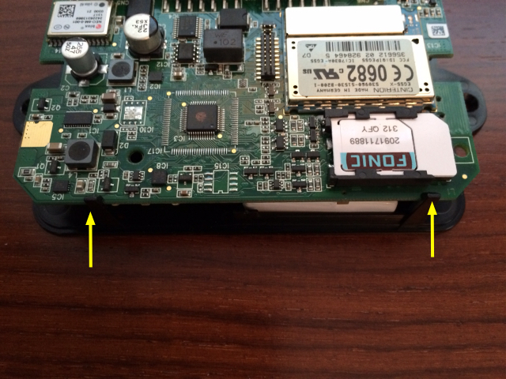

# Cabling

You now hold your first device in your hands, and there are a few
things you need to do.

* Attach battery
* Insert SIM card (unless provided)
* Connect antennae
* Connect power

### Battery

For transport safety reasons we have to unplug the battery before sending
you the devices, and we request that you reconnect that before doing
anything else.

Very _gently_ and slightly prey the two black plastic pins towards you so
that you can raise the PCB. On the underside of the PCB is a small white
socket which receives a cord with an equally small plug on it. Plug the
battery cable into that socket, lower the PCB back into it's intended 
position so that it snaps back into place.

### SIM card

If you haven't ordered a SIM card, you will need a data card *which must not
have a PIN set on it*. (In case of doubt, insert the SIM card into an old
mobile phone and remove the PIN.) The SIM card must be inserted as shown
on the photo above -- the contacts on the bottom left.

### Antennae

The combined GPS/GSM antenna contains a GPS/GSM signal reception element (round,
black), 3m double wire connection cable and 2 FAKRA connectors (BLUE: GPS, PURPLE: GSM).
Connect the blue FAKRA connector to the socket marked GPS and the purple FAKRA
connector to the socket marked GSM.

For proper GPS signal reception, place the reception element near the windshield (eg
dashboard of the vehicle). The reception element should be able to "see" the sky.

### Power cable

Plug the 14-pin Molex connector into the back of the device, using the outlet
marked `S1`. The device has a fuse holder already connected to the provided
cable. Just connect the *RED* and *BLACK* wires to the vehicle's power supply
(12V or 24V DC).

